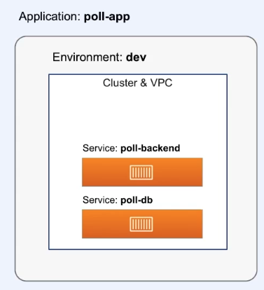

## backend 서비스 구성



1. 프로젝트 루트 위치에 Dockerfile.backend 파일 생성
```
FROM python:3.8-slim-buster

ENV PYTHONUNBUFFERED 1
ENV PYTHONDONTWRITEBYTECODE 1

RUN apt-get update \
  && apt-get install -y gcc libpq-dev python-dev \
  && rm -rf /var/lib/apt/lists/*

WORKDIR /usr/src/app
COPY requirements.txt ./
RUN pip install -r requirements.txt
COPY . .

EXPOSE 8000
ENTRYPOINT [ "sh", "./docker-entrypoint.sh" ]
```

2. 프로젝트 루트 위치에 docker-entrypoint.sh 파일 생성
+ 앱 실행 전에 스키마 변경 내용을 반영하는 migrate 커맨드 실행
```
#!/bin/bash

# Apply database migrations
echo "Apply database migrations"
python manage.py migrate

# Start server
echo "Starting server"
gunicorn --bind 0.0.0.0:8000 --workers 3 pollme.wsgi:application
```

3. Database 엔드포인트 설정
+ pollme/settings.py
```
DATABASES = {
    'default': {
        'ENGINE': 'django.db.backends.postgresql',
        'NAME': os.environ.get('POSTGRES_DB'),
        'USER': os.environ.get('POSTGRES_USER'),
        'PASSWORD': os.environ.get('POSTGRES_PASSWORD'),
        #'HOST': os.environ.get('POSTGRES_HOST'),
        'HOST': "poll-db.{}".format(os.environ.get('COPILOT_SERVICE_DISCOVERY_ENDPOINT')),
        'PORT': '5432',
    }
}
```

4. Poll backend 서비스 생성
```
copilot init
# Workload type: Backend Service
# Service name: poll-backend
# Dockerfile: ./Dockerfile.backend
```

5. 포트 정보 추가 및 데이터베이스 접속을 위한 환경 변수 설정
+ copilot/poll-backend/manifest.yml
```
...
image:
  # Docker build arguments. For additional overrides: https://aws.github.io/copilot-cli/docs/manifest/backend-service/#image-build
  build: Dockerfile.backend
  # Port exposed through your container to route traffic to it.
  port: 8000   # 포트정보 추가

...

variables:                    # Pass environment variables as key value pairs.
  POSTGRES_DB: poll     # DB관련 환경변수 추가 
  POSTGRES_USER: fast
  POSTGRES_PASSWORD: 1234qwer

....
```

6. Poll backend 서비스 배포
copilot deploy

7. AWS Web Console에서 Poll backend 서비스 배포 상태 확인 


