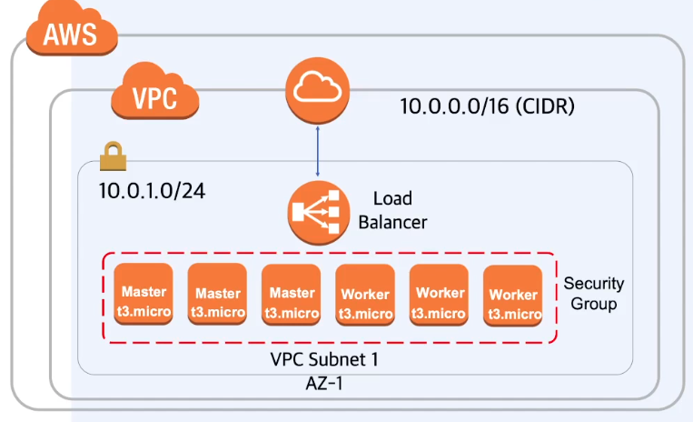

# Provisioning Compute Resources



[Guide](https://github.com/kelseyhightower/kubernetes-the-hard-way/blob/master/docs/03-compute-resources.md)

## Networking

### VPC

```sh
VPC_ID=$(aws ec2 create-vpc --cidr-block 10.0.0.0/16 --output text --query 'Vpc.VpcId')
aws ec2 create-tags --resources ${VPC_ID} --tags Key=Name,Value=kubernetes-the-hard-way
aws ec2 modify-vpc-attribute --vpc-id ${VPC_ID} --enable-dns-support '{"Value": true}'
aws ec2 modify-vpc-attribute --vpc-id ${VPC_ID} --enable-dns-hostnames '{"Value": true}'
```

### Subnet

```sh
SUBNET_ID=$(aws ec2 create-subnet \
  --vpc-id ${VPC_ID} \
  --cidr-block 10.0.1.0/24 \
  --output text --query 'Subnet.SubnetId')
aws ec2 create-tags --resources ${SUBNET_ID} --tags Key=Name,Value=kubernetes
```

### Internet Gateway

```sh
INTERNET_GATEWAY_ID=$(aws ec2 create-internet-gateway --output text --query 'InternetGateway.InternetGatewayId')
aws ec2 create-tags --resources ${INTERNET_GATEWAY_ID} --tags Key=Name,Value=kubernetes
aws ec2 attach-internet-gateway --internet-gateway-id ${INTERNET_GATEWAY_ID} --vpc-id ${VPC_ID}
```

### Route Tables

```sh
ROUTE_TABLE_ID=$(aws ec2 create-route-table --vpc-id ${VPC_ID} --output text --query 'RouteTable.RouteTableId')
aws ec2 create-tags --resources ${ROUTE_TABLE_ID} --tags Key=Name,Value=kubernetes
aws ec2 associate-route-table --route-table-id ${ROUTE_TABLE_ID} --subnet-id ${SUBNET_ID}
aws ec2 create-route --route-table-id ${ROUTE_TABLE_ID} --destination-cidr-block 0.0.0.0/0 --gateway-id ${INTERNET_GATEWAY_ID}
```

### Security Groups (aka Firewall Rules)

```sh
SECURITY_GROUP_ID=$(aws ec2 create-security-group \
  --group-name kubernetes \
  --description "Kubernetes security group" \
  --vpc-id ${VPC_ID} \
  --output text --query 'GroupId')
aws ec2 create-tags --resources ${SECURITY_GROUP_ID} --tags Key=Name,Value=kubernetes
aws ec2 authorize-security-group-ingress --group-id ${SECURITY_GROUP_ID} --protocol all --cidr 10.0.0.0/16
aws ec2 authorize-security-group-ingress --group-id ${SECURITY_GROUP_ID} --protocol all --cidr 10.200.0.0/16
aws ec2 authorize-security-group-ingress --group-id ${SECURITY_GROUP_ID} --protocol tcp --port 22 --cidr 0.0.0.0/0
aws ec2 authorize-security-group-ingress --group-id ${SECURITY_GROUP_ID} --protocol tcp --port 6443 --cidr 0.0.0.0/0
aws ec2 authorize-security-group-ingress --group-id ${SECURITY_GROUP_ID} --protocol tcp --port 443 --cidr 0.0.0.0/0
aws ec2 authorize-security-group-ingress --group-id ${SECURITY_GROUP_ID} --protocol icmp --port -1 --cidr 0.0.0.0/0
```

### Kubernetes Public Access - Create a Network Load Balancer

```sh
  LOAD_BALANCER_ARN=$(aws elbv2 create-load-balancer \
    --name kubernetes \
    --subnets ${SUBNET_ID} \
    --scheme internet-facing \
    --type network \
    --output text --query 'LoadBalancers[].LoadBalancerArn')
  TARGET_GROUP_ARN=$(aws elbv2 create-target-group \
    --name kubernetes \
    --protocol TCP \
    --port 6443 \
    --vpc-id ${VPC_ID} \
    --target-type ip \
    --output text --query 'TargetGroups[].TargetGroupArn')
  aws elbv2 register-targets --target-group-arn ${TARGET_GROUP_ARN} --targets Id=10.0.1.1{0,1,2}
  aws elbv2 create-listener \
    --load-balancer-arn ${LOAD_BALANCER_ARN} \
    --protocol TCP \
    --port 443 \
    --default-actions Type=forward,TargetGroupArn=${TARGET_GROUP_ARN} \
    --output text --query 'Listeners[].ListenerArn'
```

```sh
KUBERNETES_PUBLIC_ADDRESS=$(aws elbv2 describe-load-balancers \
  --load-balancer-arns ${LOAD_BALANCER_ARN} \
  --output text --query 'LoadBalancers[].DNSName')
```

## Compute Instances

### Instance Image

```sh
sudo apt update
sudo apt install -y jq

IMAGE_ID=$(aws ec2 describe-images --owners 099720109477 \
  --output json \
  --filters \
  'Name=root-device-type,Values=ebs' \
  'Name=architecture,Values=x86_64' \
  'Name=name,Values=ubuntu/images/hvm-ssd/ubuntu-focal-20.04-amd64-server-*' \
  | jq -r '.Images|sort_by(.Name)[-1]|.ImageId')
```

### SSH Key Pair

```sh
mkdir ~/k8s-demo
cd ~/k8s-demo
aws ec2 create-key-pair --key-name kubernetes --output text --query 'KeyMaterial' > kubernetes.id_rsa
chmod 600 kubernetes.id_rsa
```

### Kubernetes Master Nodes

Using `t3.micro` instances

```sh
for i in 0 1 2; do
  instance_id=$(aws ec2 run-instances \
    --associate-public-ip-address \
    --image-id ${IMAGE_ID} \
    --count 1 \
    --key-name kubernetes \
    --security-group-ids ${SECURITY_GROUP_ID} \
    --instance-type t3.micro \
    --private-ip-address 10.0.1.1${i} \
    --user-data "name=controller-${i}" \
    --subnet-id ${SUBNET_ID} \
    --block-device-mappings='{"DeviceName": "/dev/sda1", "Ebs": { "VolumeSize": 50 }, "NoDevice": "" }' \
    --output text --query 'Instances[].InstanceId')
  aws ec2 modify-instance-attribute --instance-id ${instance_id} --no-source-dest-check
  aws ec2 create-tags --resources ${instance_id} --tags "Key=Name,Value=controller-${i}"
  echo "controller-${i} created "
done
```

### Kubernetes Worker Nodes

```sh
for i in 0 1 2; do
  instance_id=$(aws ec2 run-instances \
    --associate-public-ip-address \
    --image-id ${IMAGE_ID} \
    --count 1 \
    --key-name kubernetes \
    --security-group-ids ${SECURITY_GROUP_ID} \
    --instance-type t3.micro \
    --private-ip-address 10.0.1.2${i} \
    --user-data "name=worker-${i}|pod-cidr=10.200.${i}.0/24" \
    --subnet-id ${SUBNET_ID} \
    --block-device-mappings='{"DeviceName": "/dev/sda1", "Ebs": { "VolumeSize": 50 }, "NoDevice": "" }' \
    --output text --query 'Instances[].InstanceId')
  aws ec2 modify-instance-attribute --instance-id ${instance_id} --no-source-dest-check
  aws ec2 create-tags --resources ${instance_id} --tags "Key=Name,Value=worker-${i}"
  echo "worker-${i} created"
done
```

Next: [Certificate Authority](04-certificate-authority.md)
